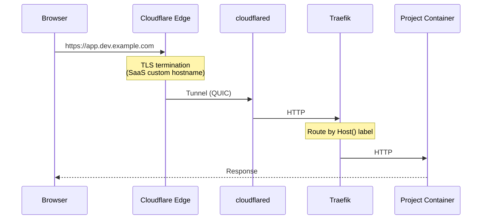

# devtun

Public HTTPS URLs for local Docker containers. Run your projects locally, access them from anywhere at `https://<project>.<your-dev-subdomain>`.

Uses **Traefik** for automatic reverse proxy discovery, a **Cloudflare Tunnel** to expose it to the internet, and **Cloudflare for SaaS** to issue per-project edge SSL certificates.

## Architecture



Cloudflare handles TLS at the edge. The tunnel sends plain HTTP to Traefik. Traefik routes to your project container based on `Host()` labels. No local certificates to manage.

### Why Cloudflare for SaaS?

Cloudflare's free Universal SSL covers `*.example.com` but not `*.dev.example.com` -- wildcard certs only go one level deep. Advanced Certificate Manager ($10/mo) would cover it, but Cloudflare for SaaS issues individual edge SSL certificates per hostname for free (up to 100). devtun automates this completely.

## Prerequisites

- Node.js 18+
- Docker

```bash
npm install -g devtun
```

### Cloudflare API token

Create a Custom API Token in your [Cloudflare dashboard](https://dash.cloudflare.com/profile/api-tokens) with:

**Token Name:** devtun

**Permissions:**

| Type | Permission           | Access |
| ---- | -------------------- | ------ |
| Zone | Zone Settings        | Edit   |
| Zone | SSL and Certificates | Edit   |
| Zone | DNS                  | Edit   |

**Zone Resources:**

| Type    | Which Zones   | Zone Name     |
| ------- | ------------- | ------------- |
| Include | Specific Zone | `example.com` |

You can provide the token as:
- An environment variable: `CLOUDFLARE_API_TOKEN`
- A [1Password CLI](https://developer.1password.com/docs/cli/) reference: `op://Vault/Item/field`
- A literal value in your config

## Setup

```bash
devtun setup
```

The interactive setup walks you through configuration and handles everything in order:

1. Creates your config (`~/.devtun/config.json`)
2. Checks Docker is running
3. Looks up your Cloudflare zone
4. Creates a Cloudflare Tunnel (or reuses an existing one)
5. Configures SSL mode and Universal SSL
6. Enables Cloudflare for SaaS and sets up the fallback origin
7. Generates a Docker Compose file and starts Traefik + the tunnel

If setup is interrupted partway through, just run `devtun setup` again -- each step checks whether it's already been completed.

The only manual step is enabling Cloudflare for SaaS in the dashboard the first time. The setup detects this and gives you the URL.

## Usage

### Register a project

From your project directory:

```bash
devtun add myapp
```

This:
1. Creates a DNS record and edge SSL certificate for `myapp.<your-dev-subdomain>`
2. Detects your Docker Compose service and port
3. Generates a `docker-compose.override.yml` with Traefik labels
4. Optionally restarts your containers

SSL typically activates within seconds.

### Manage projects

```bash
devtun add <name>        # Register hostname and configure Docker labels
devtun list              # List all registered project hostnames
devtun status <name>     # Check SSL and routing status
devtun remove <name>     # Remove hostname, DNS record, and labels
```

### Infrastructure

```bash
devtun up                # Start Traefik + tunnel containers
devtun down              # Stop Traefik + tunnel containers
devtun autostart enable  # Start on login (macOS/Linux)
```

### Configuration

```bash
devtun config            # Show current configuration
devtun config set <k> <v>  # Update a config value
devtun config get <key>  # Get a config value
```

### Full workflow for a new project

```bash
# One-time setup (if not done already):
devtun setup

# In your project directory:
devtun add myapp

# Done -- https://myapp.dev.example.com/ is live
```

devtun auto-detects your service and port from `docker-compose.yml` and generates the override file for you.

## How it works

When you run `devtun add`, it:
- Creates a CNAME record pointing `myapp.dev.example.com` to your tunnel's fallback origin
- Registers a Cloudflare for SaaS custom hostname, which triggers edge SSL certificate issuance
- Writes a `docker-compose.override.yml` in your project with Traefik routing labels and the `devtun` network

Your project container connects to Traefik via the shared `devtun` Docker network. Traefik discovers it by its labels, and the Cloudflare Tunnel forwards incoming requests from the edge.

## Dashboard

Traefik dashboard: http://localhost:8080 -- shows all discovered routes and their health.

## Releasing

Pushes to `main` automatically publish to npm via [semantic-release](https://github.com/semantic-release/semantic-release). The version bump is determined by commit messages:

- `fix: ...` - patch release (0.0.x)
- `feat: ...` - minor release (0.x.0)
- `feat!: ...` or `BREAKING CHANGE:` in the commit body - major release (x.0.0)

Commits that don't match a release type (e.g. `chore:`, `docs:`, `ci:`) won't trigger a release.

The pipeline builds, type-checks, verifies dependency signatures, then publishes with npm provenance attestations. It also auto-generates a CHANGELOG and commits the version bump back to the repo.

## Troubleshooting

**522 error (origin unreachable)**: The tunnel can't reach Traefik, or Traefik can't reach your container. Check that `devtun up` has been run, and that your project container is on the `devtun` network. Run `docker network inspect devtun` to see connected containers.

**SSL handshake failure**: The hostname probably doesn't have a custom hostname registered. Run `devtun status <name>` to check, or `devtun add <name>` to register it.

**Tunnel not connecting**: Run `docker compose logs tunnel` in `~/.devtun/`. If the tunnel token is missing, re-run `devtun setup`.

**Project not routing**: Check the Traefik dashboard at http://localhost:8080. Verify your project has a `docker-compose.override.yml` with the correct labels and is on the `devtun` network. Make sure entrypoints is `web` (not `websecure`).

**Starting fresh**:

```bash
devtun down
rm -rf ~/.devtun
devtun setup
```
