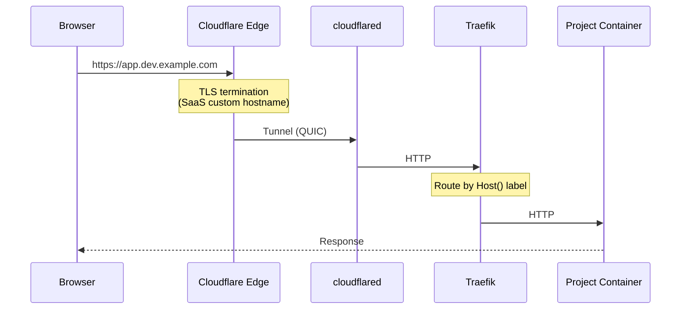

# devtun

Public HTTPS URLs for local Docker containers. Run your projects locally, access them from anywhere at `https://<project>.<your-dev-subdomain>`.

Uses **Traefik** for automatic reverse proxy discovery, a **Cloudflare Tunnel** to expose it to the internet, and **Cloudflare for SaaS** to issue per-project edge SSL certificates.

## Architecture


```mermaid
sequenceDiagram
    participant Browser
    participant CF as Cloudflare Edge
    participant CD as cloudflared
    participant T as Traefik
    participant App as Project Container

    Browser->>CF: https://app.dev.example.com
    Note over CF: TLS termination<br/>(SaaS custom hostname)
    CF->>CD: Tunnel (QUIC)
    CD->>T: HTTP
    Note over T: Route by Host() label
    T->>App: HTTP
    App-->>Browser: Response
```

Cloudflare handles TLS at the edge. The tunnel sends plain HTTP to Traefik. Traefik routes to your project container based on `Host()` labels. No local certificates to manage.

### Why Cloudflare for SaaS?

Cloudflare's free Universal SSL covers `*.example.com` but not `*.dev.example.com` -- wildcard certs only go one level deep. Advanced Certificate Manager ($10/mo) would cover it, but Cloudflare for SaaS issues individual edge SSL certificates per hostname for free (up to 100). devtun automates this completely.

## Prerequisites

- Node.js 18+
- Docker

```bash
npm install -g devtun
```

### Cloudflare API token

Create a Custom API Token in your [Cloudflare dashboard](https://dash.cloudflare.com/profile/api-tokens) with:

**Token Name:** devtun

**Permissions:**

| Type | Permission           | Access |
| ---- | -------------------- | ------ |
| Zone | Zone Settings        | Edit   |
| Zone | SSL and Certificates | Edit   |
| Zone | DNS                  | Edit   |

**Zone Resources:**

| Type    | Which Zones   | Zone Name     |
| ------- | ------------- | ------------- |
| Include | Specific Zone | `example.com` |

You can provide the token as:
- An environment variable: `CLOUDFLARE_API_TOKEN`
- A [1Password CLI](https://developer.1password.com/docs/cli/) reference: `op://Vault/Item/field`
- A literal value in your config

## Setup

```bash
devtun setup
```

The interactive setup walks you through configuration and handles everything in order:

1. Creates your config (`~/.devtun/config.json`)
2. Checks Docker is running
3. Looks up your Cloudflare zone
4. Creates a Cloudflare Tunnel (or reuses an existing one)
5. Configures SSL mode and Universal SSL
6. Enables Cloudflare for SaaS and sets up the fallback origin
7. Generates a Docker Compose file and starts Traefik + the tunnel

If setup is interrupted partway through, just run `devtun setup` again -- each step checks whether it's already been completed.

The only manual step is enabling Cloudflare for SaaS in the dashboard the first time. The setup detects this and gives you the URL.

## Usage

### Register a project

From your project directory:

```bash
devtun add myapp web 3000
```

This:
1. Creates a DNS record and edge SSL certificate for `myapp.<your-dev-subdomain>`
2. Generates a `docker-compose.override.yml` with Traefik labels routing to the `web` service on port `3000`
3. Optionally restarts your containers

You can map multiple hostnames to different services in the same project:

```bash
devtun add myapp web 3000
devtun add myapp-mail mail 8025
```

SSL typically activates within seconds.

#### Cache headers

Dev tunnels default to aggressive no-cache behaviour because stale assets are the #1 source of "but it works on my machine" while iterating. The Traefik middleware that ships with `devtun add` sets both:

- `CDN-Cache-Control: no-store` - tells the Cloudflare edge not to cache
- `Cache-Control: no-store, no-cache, must-revalidate, max-age=0` - tells the browser not to cache (necessary because iOS Safari/Brave ignore `CDN-Cache-Control` and Next.js dev's default `no-cache, must-revalidate` is interpreted loosely)

Override with `--cache <mode>`:

```bash
devtun add myapp web 3000                    # default: --cache all
devtun add myapp web 3000 --cache cdn        # CDN bypass only; app controls browser caching
devtun add myapp web 3000 --cache none       # no middleware; upstream headers pass through
```

### Manage projects

```bash
devtun add <name> <svc> <port>  # Register hostname routing to service on port
                                #   Flags: --restart | --no-restart | --yes (-y)
                                #          --cache none|cdn|all (default: all)
devtun list              # List all registered project hostnames
devtun status <name>     # Check SSL and routing status
devtun remove <name>     # Remove hostname, DNS record, and labels
                         #   Flags: --restart | --no-restart | --yes (-y)
```

### Infrastructure

```bash
devtun up                # Start Traefik + tunnel containers
devtun down              # Stop Traefik + tunnel containers
devtun autostart enable  # Start on login (macOS/Linux)
devtun doctor            # Health-check config, Cloudflare, Docker
```

### Configuration

```bash
devtun config            # Show current configuration
devtun config set <k> <v>  # Update a config value
devtun config get <key>  # Get a config value
```

Beyond the Cloudflare keys (`domain`, `devSubdomain`, `tunnelName`, `cfTokenSource`), three infra keys control the generated stack (run `devtun up` after changing them):

- `dockerSocket` -- host Docker socket the instance's Traefik watches and the CLI talks to (default `/var/run/docker.sock`). On hosts with more than one Docker daemon, point each instance at its daemon's socket.
- `publishHttpPort` -- publish Traefik's HTTP entrypoint on a host port (e.g. `80`), or `off` (default). Not needed for tunnel routing: cloudflared reaches Traefik over the instance's Docker network.
- `dashboardPort` -- publish the Traefik dashboard on `127.0.0.1:<port>`, or `off` (default).

If you hand-edit the generated `docker-compose.yml` socket mount, `devtun up` refuses to regenerate until config agrees (`devtun doctor` detects this and prints the exact `config set dockerSocket` command).

### Multiple instances

devtun can run several fully independent instances on one host -- each with its own Cloudflare tunnel, base FQDN, Docker network, containers, and (optionally) Docker daemon:

```bash
# Default instance lives at ~/.devtun; named instances at ~/.devtun/instances/<name>
devtun setup -i alt --domain other.com --dev-subdomain dev.other.com \
  --docker-socket /var/run/docker.sock --yes

devtun instances         # List instances with FQDN, socket, and state
devtun up -i alt         # Instance lifecycles are independent
devtun add myapp web 3000 -i alt   # Project joins the 'alt' network, gets *.dev.other.com
```

Every command accepts `--instance <name>` (`-i`), falling back to `$DEVTUN_INSTANCE`, then the default instance `devtun`. Instance names become Docker network and container names (`<name>-traefik`, `<name>-tunnel`), so they're validated: lowercase/digits/hyphens, max 32 chars, and reserved names (`docker0`, `default`, `bridge`, `host`, `none`) are refused.

#### Custom hostnames outside the dev subdomain (`--fqdn`)

`devtun add` normally registers `<name>.<devSubdomain>`, which the tunnel's wildcard ingress (`*.<devSubdomain>`) already routes. To route a hostname *outside* that wildcard -- e.g. an apex-level `app.holodeck.build` on an instance whose dev subdomain is `preview.holodeck.build` -- pass `--fqdn`:

```bash
devtun add app webapp 3000 -i holodeck --fqdn app.holodeck.build
devtun remove app -i holodeck --fqdn app.holodeck.build
```

The hostname must live inside the instance's zone. Beyond the usual DNS record + custom hostname + Traefik `Host()` label, devtun adds a dedicated tunnel ingress rule for the FQDN and persists it in the instance config (`extraFqdns`), so re-running `devtun setup` keeps the rule. Hostnames that *are* under the dev wildcard don't need `--fqdn` and get no extra ingress rule.

**The daemon coupling**: Docker networks are per-daemon, so a project can only attach to an instance running on the same Docker daemon (the instance's `dockerSocket`). Which instance you `add` a project to determines both its public FQDN and which daemon it must run on.

### Scripting and CI

`devtun` is designed to run unattended. When stdin or stdout is not a TTY (e.g., piped, in a CI job, or invoked from an automation tool), it never prompts.

**`add` and `remove`** ask "restart containers?" at the end. In a non-TTY context they default to **not restarting** (safe default — the Cloudflare side is still updated). Use flags to be explicit:

```bash
devtun add myapp web 3000 --restart      # always restart, never prompt
devtun add myapp web 3000 --no-restart   # never restart, never prompt
devtun add myapp web 3000 --yes          # alias for --restart
devtun add myapp web 3000 -y             # short alias for --yes
```

`remove` accepts the same flags.

In a TTY, the existing interactive prompt still appears unless you pass one of the flags above.

The Cloudflare API token can come from the `CLOUDFLARE_API_TOKEN` environment variable, a `cfTokenSource` set to a 1Password `op://` reference, or a literal value in config. For CI, env var is the simplest.

#### Structured output (`--json`)

`list`, `status`, `doctor`, and `config` accept `--json`. The output is a single JSON document on stdout suitable for piping into `jq`. Errors still go to stderr; exit codes are unchanged (`doctor` exits 1 on any failure, `status <name>` exits 1 if the hostname isn't registered, etc.). `tunnelToken` is never included in JSON output.

```bash
devtun list --json                  # array of { hostname, service, port, status, ssl }
devtun status --json                # infra: { domain, devSubdomain, tunnel, zoneId, fallback, projects }
devtun status myapp --json          # one project: { hostname, registered, status, ssl, createdAt, ... }
devtun doctor --json                # { summary: {ok, warn, fail, skip}, checks: [{name, status, detail}] }
devtun config --json                # the config object minus tunnelToken
devtun config get domain --json     # { domain: "example.com" }
```

Example: gate a deploy on all checks passing:

```bash
devtun doctor --json | jq -e '.summary.fail == 0 and .summary.warn == 0' >/dev/null
```

#### Per-command help

Every command supports `--help` (or `-h`) and prints a man-style page with synopsis, arguments, flags, environment variables, exit codes, and worked examples:

```bash
devtun add --help              # human-readable help
devtun add --json --help       # the same help as a JSON document (for tools)
```

#### Unattended setup

`devtun setup` accepts all initial values via flags or env vars, so it can run without prompts:

```bash
CLOUDFLARE_API_TOKEN=... devtun setup \
  --domain example.com \
  --dev-subdomain dev.example.com \
  --tunnel-name dev-example-com \
  --yes
```

| Flag | Env var | Default |
| ---- | ------- | ------- |
| `--domain` | `DEVTUN_DOMAIN` | (required) |
| `--dev-subdomain` | `DEVTUN_DEV_SUBDOMAIN` | `dev.<domain>` |
| `--tunnel-name` | `DEVTUN_TUNNEL_NAME` | `dev-<dashified-domain>` |
| `--cf-token-source` | (use `CLOUDFLARE_API_TOKEN` instead) | (none) |
| `--yes` / `-y` | | confirms destructive prompts (e.g. recreating a locally-managed tunnel) |

If Cloudflare for SaaS isn't yet enabled in the dashboard, setup will exit with code 2 and the dashboard URL in stderr (non-TTY) or pause for you to enable it (TTY).

### Changing your domain or subdomain

If you need to move all your projects to a new domain or subdomain, the order matters: `devtun remove` uses the *current* config to know which Cloudflare zone to clean up.

1. List what's registered: `devtun list`
2. For each project, run `devtun remove <name>` from that project's directory. This deletes the Cloudflare custom hostname, DNS record, and TXT verification record, and cleans the project's `docker-compose.override.yml`.
3. Change the config: `devtun config set domain new.example.com` (and `devtun config set devSubdomain dev.new.example.com` if needed). `devtun` will verify your Cloudflare API token has access to the new zone, refuse the change if any custom hostnames are still registered on the old zone (use `--force` to override), and clear the cached `zoneId`/`tunnelId` so setup re-resolves them.
4. Run `devtun setup` again. It'll create a new tunnel and SaaS setup for the new zone.
5. Re-add each project: `devtun add <name> <service> <port>`.

If you skipped step 2, the custom hostnames on the old zone become orphans (they'll keep using slots toward your 100-hostname SaaS free limit). Clean them up in the Cloudflare dashboard, or temporarily restore the old domain in `~/.devtun/config.json`, run `devtun remove` for each, then switch back.

Run `devtun doctor` at any point to verify the current state of your config, tunnel, and zone.

### Full workflow for a new project

```bash
# One-time setup (if not done already):
devtun setup

# In your project directory:
devtun add myapp web 3000

# Done -- https://myapp.dev.example.com/ is live
```

## How it works

When you run `devtun add`, it:
- Creates a CNAME record pointing `myapp.dev.example.com` to your tunnel's fallback origin
- Registers a Cloudflare for SaaS custom hostname, which triggers edge SSL certificate issuance
- Writes a `docker-compose.override.yml` in your project with Traefik routing labels and the `devtun` network

Your project container connects to Traefik via the shared `devtun` Docker network. Traefik discovers it by its labels, and the Cloudflare Tunnel forwards incoming requests from the edge.

## Dashboard

The Traefik dashboard is off by default (nothing is published on host ports). Enable it per instance:

```bash
devtun config set dashboardPort 8080
devtun up
```

Then http://localhost:8080 shows all discovered routes and their health.

## Upgrading from single-instance versions

Existing `~/.devtun` installs keep working as the default instance -- no migration needed, with two changes:

- Host ports `80` and `8080` are no longer published (tunnel routing never needed them). Re-enable with `devtun config set publishHttpPort 80` / `dashboardPort 8080` if you relied on `http://localhost`.
- If you had hand-edited `docker-compose.yml` to mount a different Docker socket, `devtun up` now refuses to clobber it. Adopt the edit with `devtun config set dockerSocket <path>`, then `devtun up`. If autostart is enabled, re-run `devtun autostart enable` so the unit exports `DOCKER_HOST`. If the old containers were ever created on a different daemon than the one in config, remove that stale pair once by hand (`docker rm -f devtun-traefik devtun-tunnel` against that daemon).

## Releasing

Pushes to `main` automatically publish to npm via [semantic-release](https://github.com/semantic-release/semantic-release). The version bump is determined by commit messages:

- `fix: ...` - patch release (0.0.x)
- `feat: ...` - minor release (0.x.0)
- `feat!: ...` or `BREAKING CHANGE:` in the commit body - major release (x.0.0)

Commits that don't match a release type (e.g. `chore:`, `docs:`, `ci:`) won't trigger a release.

The pipeline builds, type-checks, verifies dependency signatures, then publishes with npm provenance attestations. It also auto-generates a CHANGELOG and commits the version bump back to the repo.

## Troubleshooting

**First step for any problem**: run `devtun doctor`. It validates your Cloudflare token, checks that your tunnel and zone are still in sync with your config, lists any orphaned custom hostnames (registered on a subdomain other than your current one), and reports whether the Docker stack is up.

**522 error (origin unreachable)**: The tunnel can't reach Traefik, or Traefik can't reach your container. Check that `devtun up` has been run, and that your project container is on the `devtun` network. Run `docker network inspect devtun` to see connected containers.

**SSL handshake failure**: The hostname probably doesn't have a custom hostname registered. Run `devtun status <name>` to check, or `devtun add <name> <service> <port>` to register it.

**Tunnel not connecting**: Run `docker compose logs tunnel` in `~/.devtun/`. If the tunnel token is missing, re-run `devtun setup`.

**Project not routing**: Check the Traefik dashboard at http://localhost:8080. Verify your project has a `docker-compose.override.yml` with the correct labels and is on the `devtun` network. Make sure entrypoints is `web` (not `websecure`).

**Starting fresh**:

```bash
devtun down
rm -rf ~/.devtun
devtun setup
```
